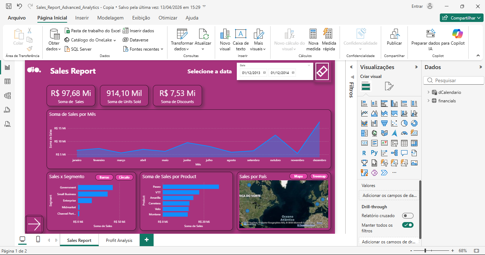
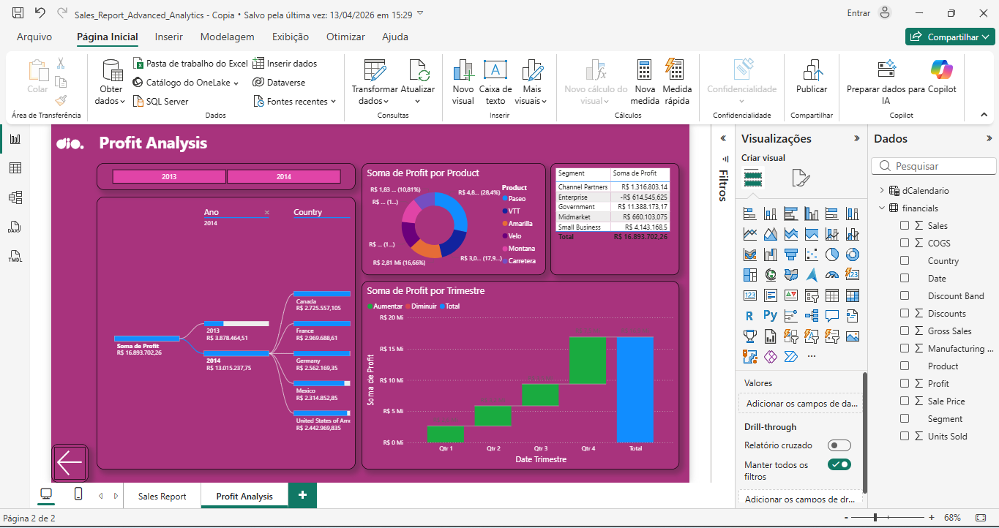

# 📊 Desafio de Projeto: Modernização e Otimização de Dashboard (UX/UI Nativo)

Este repositório contém o projeto de **Reformulação Visual e Otimização** de um relatório financeiro no **Microsoft Power BI**. O foco principal foi a criação de um layout moderno e funcional utilizando recursos estritamente nativos para garantir a melhor performance e usabilidade.

---

## 🏛️ Contexto e Parcerias

* **Plataforma de Ensino**: [DIO (Digital Innovation One)](https://www.dio.me/)
* **Empresa Patrocinadora**: [Klabin](https://www.klabin.com.br/)
* **Formação**: Power BI Analyst
* **Desenvolvedor**: [Fred Cavalheiro]

---

## 🛠️ Tecnologias Utilizadas

* **[Microsoft Power BI Desktop](https://powerbi.microsoft.com/)**: Ferramenta utilizada para o desenvolvimento dos gráficos e toda a interface visual.
* **Design Nativo**: Aplicação de cores, transparências e bordas diretamente nas configurações dos visuais.
* **Otimização de Layout**: Organização de dados para facilitar a leitura e interpretação rápida.

---

## ⚠️ Justificativa Técnica e Adaptações de Ambiente

Este projeto reflete um processo de **resiliência e superação de barreiras técnicas**:

* **Hardware e Estabilidade**: O desenvolvimento foi realizado em uma máquina emprestada com hardware limitado, enfrentando lentidões e congelamentos constantes do Power BI. Para manter o arquivo leve e o sistema funcional, evitei o uso de qualquer imagem de fundo ou formas externas pesadas, trabalhando apenas com recursos nativos.
* **Limitação de Acesso (E-mail Corporativo)**: Devido à exigência do Power BI por um e-mail corporativo para acesso a recursos de publicação e design avançado (o qual não possuo, utilizando conta pessoal), o projeto foi focado na execução local de alta qualidade.
* **Foco na Produtividade vs. Pop-ups**: Optei por remover todas as camadas de formas e layouts de capa sugeridos no curso original. Na prática, esses elementos sobrepostos geravam pop-ups incessantes a cada clique, o que desconcentrava e atrasava significativamente o fluxo de trabalho. A solução foi aplicar toda a estética (fundo e arredondamentos) diretamente nos gráficos, eliminando interrupções e garantindo um ambiente de desenvolvimento mais ágil.
* **Clareza dos Dados**: Substituí visuais saturados por tabelas e gráficos limpos, garantindo que a informação seja o centro do projeto, sem elementos decorativos que prejudiquem a performance.

---

## 📂 Entregáveis do Projeto

Abaixo, os links para os arquivos e evidências do projeto:

* [📥 **Baixar Arquivo Power BI (.pbix)**](Modern-Dashboard-Optimization-PowerBI.pbix)  
  > *Nota: Você precisará do Microsoft Power BI Desktop instalado para abrir este arquivo.*
* [🖼️ **Ver Página 1 (Sales Report)**](01-sales-report-dashboard.png)
* [🖼️ **Ver Página 2 (Profit Analysis)**](02-profit-analysis-dashboard.png)

---

## 🚀 Estrutura das Páginas

O relatório foi organizado em duas frentes de análise:

### 1. Sales Report
* Exibição de métricas de vendas por produto e segmento.
* Organização pensada no fluxo de leitura rápida dos principais indicadores.

### 2. Profit Analysis
* Análise detalhada da lucratividade.
* Uso de **Tabela de Dados** em vez de gráficos de blocos para evitar nomes cortados e garantir precisão na leitura dos valores de lucro.

---

## ⚙️ Evidências Visuais (Resultado Final)

1. **Página 01 - Sales Report:** 

2. **Página 02 - Profit Analysis:** 

---

## 📞 Contato e Conexão
**Fred Cavalheiro**
* 🔄 **Transição de Carreira:** De Segurança Patrimonial (Vigilante) para Tecnologia/Dados.
* 🎓 **Técnico em Desenvolvimento de Sistemas** (Senac).
* 📚 **Estudante de:** Machine Learning e Análise de Dados (Python, Neo4j, Power BI e Excel).
* 🔗 **[Meu Perfil no LinkedIn](https://www.linkedin.com/in/fred-cavalheiro/)**

---
**Projeto desenvolvido para demonstrar competência em Design de Dashboards e Otimização UX em Power BI, priorizando soluções nativas e eficientes.**
